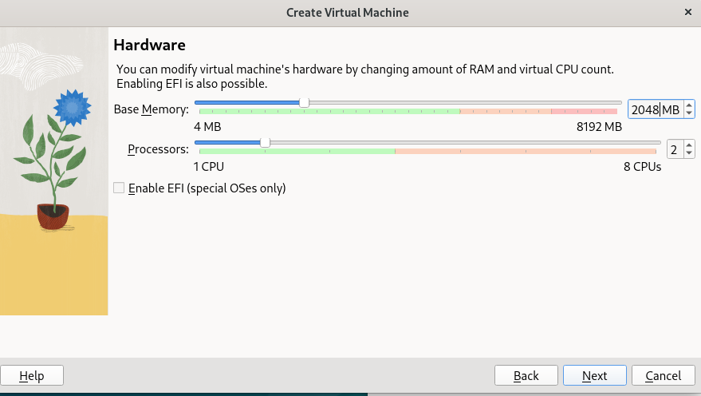

<div align="center">
  <h1 style="text-align: center;font-weight: bold">Laporan Resmi Workshop Administrasi Jaringan</h1>
  <h4 style="text-align: center;">Dosen Pengampu : Dr. Ferry Astika Saputra, S.T., M.Sc.</h4>
</div>
<br />
<div align="center">
  
  <h3 style="text-align: center;">Disusun Oleh : </h3>
  <p style="text-align: center;">
    <strong>Mochammad Fahril Rizal (3123500013)</strong><br>
  </p>
<h3 style="text-align: center;line-height: 1.5">Politeknik Elektronika Negeri Surabaya<br>Departemen Teknik Informatika Dan Komputer<br>Program Studi Teknik Informatika<br>2024/2025</h3>
  <hr><hr>
</div>

# Menginstall Debian Linux dengan VirtualBox melalui root terminal pada OS Linux

## 1. Check Ubuntu Version
### Perintah terminal
```
lsb_release -a
```
Perintah diatas adalah untuk cek detail versi os dari os Linux/UNIX

## 2. Check Dependensi 
### Perintah terminal
```
sudo apt --fix-broken install
```
Memperbaiki dependensi yang belum terpenuhi atau paket yang rusak pada sistem berbasis Linux

## 3. Install VirtualBox Debian menggunakan paket melalui terminal
### Perintah terminal

```
sudo dpkg -i virtualbox-7.1_7.1.6-167084~Debian~bookworm_amd64.deb
```
Fungsi untuk menginstal paket VirtualBox versi 7.1.6 dari file .deb secara manual menggunakan dpkg (Debian Package Manager).

## 4. Problem Solve Error Installing
Setelah install virtualbox jika muncul error
```
error The following NEW packages will be installed:
  libxcb-cursor0
```
### Perintah terminal
```
sudo apt install libxcb-cursor0
```
Install library libxcb-cursor0 pada sistem berbasis Linux

## 5. Menambah User VirtualBox
### Perintah terminal
```
sudo usermod -aG vboxusers$
```
menambahkan pengguna saat ini ke dalam grup vboxusers, yang diperlukan agar pengguna dapat menggunakan fitur tertentu di VirtualBox, seperti akses ke perangkat USB. 

## 6. Interface Installation VirtualBox Debian


Jika sudah download file ISO Debian 12, berikan lokasi file ISO tersebut kolom ISO Image.

Jika belum, bisa install melalui web https://www.debian.org/distrib/ atau bisa mengambil dari pc yang telah memiliki iso debian dengan cara berikut
### 1
```
sftp <IP Address>
```
untuk IP disesuaikan dengan IP PC/komputer yang telah memiliki iso debian
### 2
```
cd Downloads
```
pindah ke directory tempat iso berada
### 3
```
get debian-12.9.0-amd64-netinst.iso
```
untuk debian tergantung debian yang ada di PC/komputer tersebut

### Langkah berikutnya


Gunakan password "student"

### Penggunaan RAM dan Proccessors yang dibutuhkan



Untuk RAM minimalnya 2 GB dan untuk Proccessors menggunakan 2 CPU

### Penggunaan HDD yang dibutuhkan


Menggunakan 10 GB untuk alokasi memory pada Harddisk

### Validasi Kebutuhan install


Jika sudah sesuai dengan spesifikasi yang diinginkan lanjut klik Finish untuk memproses instalasi.

### Proses Instalasi Berjalan


Tunggu Hingga Proses instalasi selesai.

### Instalasi Virtualbox Debian Linux Berhasil


