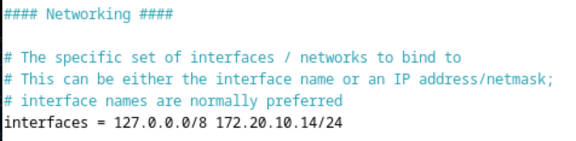

<div align="center">
  <h1 style="text-align: center;font-weight: bold">Laporan Resmi Workshop Administrasi Jaringan</h1>
  <h4 style="text-align: center;">Dosen Pengampu : Dr. Ferry Astika Saputra, S.T., M.Sc.</h4>
</div>
<br />
<div align="center">
  
  <h3 style="text-align: center;">Disusun Oleh : </h3>
  <p style="text-align: center;">
    <strong>Mochammad Fahril Rizal (3123500013)</strong><br>
  </p>
<h3 style="text-align: center;line-height: 1.5">Politeknik Elektronika Negeri Surabaya<br>Departemen Teknik Informatika Dan Komputer<br>Program Studi Teknik Informatika<br>2024/2025</h3>
  <hr><hr>
</div>

# A. Konfigurasi dan Instalasi NTP Client
## 1. Install NTP Client
```
su - 
apt -y install ntpsec
```

NTP Client

## 2. Konfigurasi pada ntp.conf
```
nano /etc/ntpsec/ntp.conf
```

Hapus comment untuk Pool 0-3, kemudian tambahkan
```
pool ntp.nict.jp iburst
```

## 3. Restart NTP dan Verifikasi Status
```
systemctl restart ntpsec
ntpq -p
```


Fungsi restart NTP untuk membaca config yang telah diubah pada langkah sebelumnya

# B. Instalasi dan Konfigurasi Samba
## 1. Install Samba
```
sudo apt install -y samba
```


## 2. Membuat Folder Kosong pada Directory Home dan Mengubah Izin
```
mkdir share
chmod 777 share
```


perintah diatas digunakan untuk membuat folder "share" kemudian mengubah izin pada folder tersebut agar semua pengguna dapat membaca, menulis dan mengeksekusi (Readable, Writeable & executeable)

## 3. Konfigurasi smb.conf untuk Public Share
```
nano /etc/samba/smb.conf
```


Pada bagian [global] tambahkan
```
unix charset = UTF-8
```
untuk mengatur karakter encoding pada sistem UNIX/Linux


Pada baguan intefaces tambahkan network yang akan diizinkan untuk mengakses, saya menggunakan network pada laptop saya yaitu "172.20.10.14/24"



Tambahkan konfigurasi [Share] dan tambahkan juga path beserta izin folder sama seperti gambar diatas

## 4. Restart Samba Service dan Tes untuk Public Shared
```
systemctl restart smbd
```


Untuk mengakses pada mac gunakan IP yang terdaftar pada Linux kemudian akses seperti gambar diatas


Jika telah berhasil menambahkan sesuai dengan IP maka tampilan pada network Location seperti gambar diatas dandapat diakses oleh semua pengguna di network yang sama

Disini saya menambahkan folder "tes" didalamnya, maka pada directory home/share yang terdapat pada linux akan bertambah juga seperti pada laptop saya

Ketika saya cek menggunakan perintah
```
ls
```
maka folder "tes" terlihat


## 6. Konfigurasi Limitide Shared Folder

```
nano /etc/samba/smb.conf
```


Tambahkan konfigurasi untuk [Limited] dan tambahkan user yang dapat mengakses folder tersebut, bila perlu set password untuk user yang telah ditambahkan

## 7. Restart Samba Service dan Tes untuk Limited Shared Folder
```
systemctl restart smbd
```

Ketika mengakses Limited dengan network yang telah ditambahkan maka akan muncul form username dan password. Masukkan username dan password yang telah dibuat sebelumnya


Limited shared folder berhasil dibuat dan dapat diakses, saya akan tes dengan membuat folder baru bernama "Limited"

# Rangkuman Package Management (Manajemen Paket) dalam Debian 12
---
Manajemen paket dalam Debian 12 berfungsi untuk menginstal, memperbarui, dan menghapus perangkat lunak dalam sistem. Debian menggunakan sistem manajemen paket **dpkg** dan **APT (Advanced Package Tool)** untuk mengelola software.

## 1. dpkg (Debian Package Manager)
**dpkg** adalah alat dasar untuk mengelola paket `.deb` di Debian.

### Perintah utama:
```bash
dpkg -i <nama_paket>.deb  # Menginstal paket
dpkg -r <nama_paket>       # Menghapus paket
dpkg -l                   # Menampilkan daftar paket yang terinstal
dpkg -S <file>            # Menemukan paket yang memiliki file tertentu
```

## 2. APT (Advanced Package Tool)
**APT** adalah alat tingkat tinggi yang digunakan untuk menangani dependensi paket dan mengunduh paket dari repositori.

### Perintah utama:
```bash
apt update                # Memperbarui daftar paket
apt upgrade               # Memperbarui semua paket yang sudah terinstal
apt install <nama_paket>  # Menginstal paket
apt remove <nama_paket>   # Menghapus paket
apt search <nama_paket>   # Mencari paket yang tersedia
```

## 3. Manajemen Repositori
Paket diunduh dari repositori resmi Debian yang terdaftar di file `/etc/apt/sources.list`.

Untuk menambahkan repositori pihak ketiga, bisa menggunakan:
```bash
echo "deb http://example.com/debian stable main" | sudo tee -a /etc/apt/sources.list
sudo apt update
```

## 4. Menggunakan APT dengan Cache dan Dependensi
```bash
apt-cache search <nama_paket>  # Mencari informasi paket
apt-cache show <nama_paket>    # Menampilkan detail paket
apt autoremove                 # Menghapus paket yang tidak diperlukan
```

## 5. Menggunakan Snap dan Flatpak
**Snap** dan **Flatpak** adalah alternatif untuk menginstal aplikasi yang lebih modern dan cross-platform.

### Instalasi Snap:
```bash
apt install snapd
snap install <nama_paket>
```

### Instalasi Flatpak:
```bash
apt install flatpak
flatpak install flathub <nama_paket>
```

# C. Kesimpulan
1. Debian 12
Debian adalah sistem operasi Linux yang terkenal karena stabilitas dan keamanannya.
Versi terbaru, Debian 12 (Bookworm), menghadirkan berbagai pembaruan dan peningkatan kinerja dibandingkan versi sebelumnya.
2. Proses Instalasi Debian 12
Buku ini menguraikan langkah-langkah instalasi Debian 12, termasuk pemilihan paket dan pengaturan awal sistem.
Dijelaskan pula penggunaan Debian Installer untuk mengelola partisi, akun pengguna, serta konfigurasi jaringan dasar.
3. Pengelolaan Pengguna dan Hak Akses
Menjelaskan cara membuat, menghapus, serta mengatur akun pengguna dalam Debian 12.
Pembahasan mengenai sistem izin file (permissions), grup pengguna, dan kebijakan keamanan yang perlu diterapkan.
4. Pengelolaan Paket dengan APT
Cara menginstal, memperbarui, dan menghapus perangkat lunak menggunakan perintah seperti apt-get, apt-cache, dan dpkg.
Penjelasan tentang repositori Debian serta cara menambahkan sumber paket baru ke dalam sistem.
5. Konfigurasi Jaringan
Membahas dasar-dasar pengaturan jaringan, termasuk alamat IP, DNS, dan gateway.
Penggunaan perintah ip, ifconfig, serta nmcli untuk mengelola koneksi jaringan.
6. Administrasi Sistem
Memantau performa sistem dengan perintah seperti top, htop, df, dan free.
Mengelola layanan menggunakan systemd (systemctl start/stop/status).
Konfigurasi keamanan jaringan melalui ufw atau iptables.
7. Keamanan Sistem
Panduan untuk meningkatkan keamanan Debian 12, seperti pembaruan sistem, manajemen akses pengguna sudo, serta pengamanan akses SSH.
Penggunaan fail2ban sebagai perlindungan terhadap serangan brute-force.
8. Backup dan Pemulihan Data
Strategi pencadangan menggunakan rsync, tar, dan cron jobs.
Metode pemulihan sistem dalam situasi kehilangan data atau kerusakan sistem.
9. Automasi dengan Skrip Bash
Pengantar scripting menggunakan Bash untuk mengotomatisasi tugas administrasi sistem.
Contoh skrip sederhana untuk monitoring sistem dan pembaruan otomatis.

## Referensi
[NTP Client](https://www.server-world.info/en/note?os=Debian_12&p=ntp&f=1)

[Samba](https://www.server-world.info/en/note?os=Debian_12&p=samba&f=1)